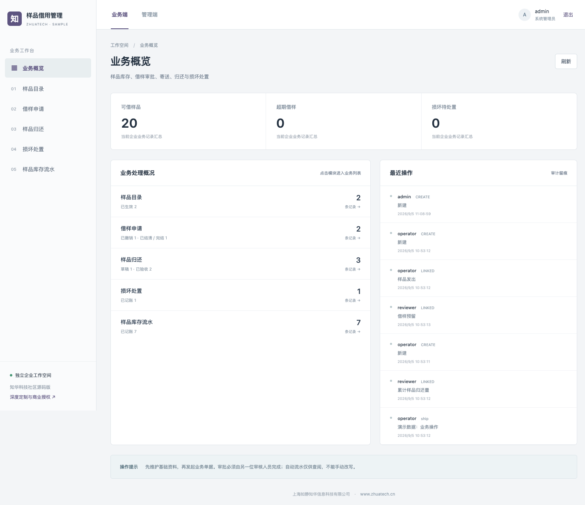
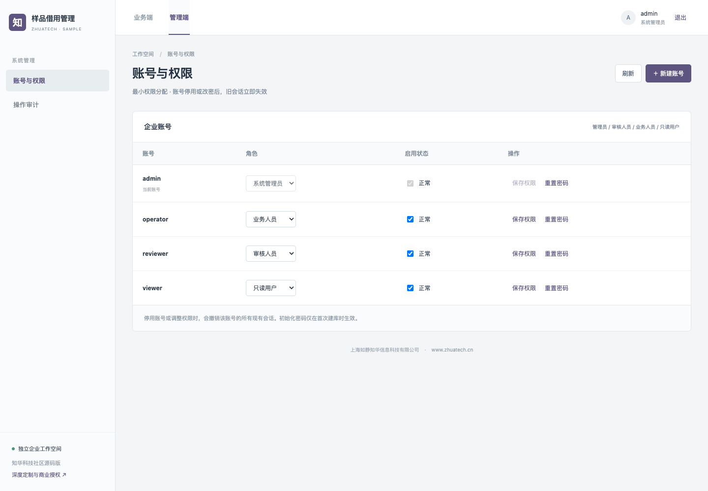
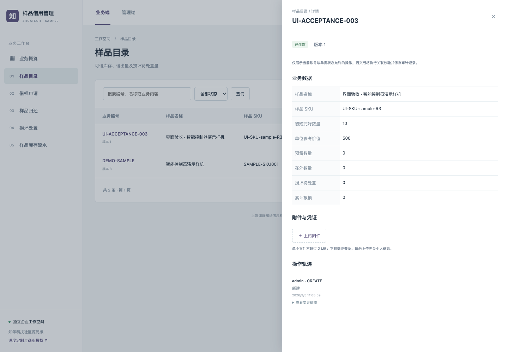

# 知华样品借用管理

> 每件样品从出库到归还都有数量去向。

由 [知华科技（上海如静知华信息科技有限公司）](https://www.zhuatech.cn/) 提供的 Java + H5 前后端分离企业软件社区源码版，数据库为 MySQL。

**许可先读**：仅限个人学习交流；未经我方书面授权不得商用，也不得用于企业内部生产业务。这里的“开源版”指公开源码学习版本，并非 OSI 认可的开源许可。详见 [LICENSE](LICENSE)。
## 使用路径

样品目录与库存 → 借样审批预留 → 交接寄送 → 分批验收归还 → 完好返库/损坏隔离 → 修复或报损 → 结案

审批先预留可借库存，发货再扣减在库并增加在外数量。每次归还分别更新完好库存与损坏库存，阻止超量归还；支持延期审批、未还数量检查和损坏样品修复或报损。

| 模块 | 已实现功能 | 可执行操作 |
|---|---|---|
| 样品目录 | 可借库存、借出量及损坏待处置量 | 补充样品入库 |
| 借样申请 | 预约库存、领用寄送、分批归还与结案 | 审批预留、发出样品、批准延期、完成结案、取消并释放 |
| 样品归还 | 合格返库与损坏隔离，防止超量归还 | 确认验收 |
| 损坏处置 | 审批报损或修复转为可借库存 | 批准处置 |
| 样品库存流水 | 预留、发出、归还、修复与报损的追溯账 | 业务动作自动生成、查询、追溯、导出 |

```bash
docker compose --env-file .env.demo.example up --build -d
```

打开 http://localhost:8088 。演示账号：`admin / Demo-Admin-2026!`，`operator / Demo-Operator-2026!`，`reviewer / Demo-Review-2026!`，`viewer / Demo-Viewer-2026!`。这些均为公开的本机演示密码，禁止在公网或生产使用。

生产配置使用 `.env.example` 填入独立强密码，关闭 `DEMO_MODE`，详见 [部署与备份](docs/DEPLOYMENT.md)。演示模式只在空业务库中初始化数据，不会每次重启重置业务。
## 页面实录

下图来自本项目实际运行的 H5 页面，数据为自动执行真实业务接口产生的演示记录，不是效果图。



业务端：模块导航、数量与业务指标、状态查询、详情及操作轨迹；按状态展示可用操作。



管理端：分配业务/审核/只读角色，停用账号、重置密码；独立审计页记录业务和管理动作。
<details>
<summary>查看真实业务详情与移动端</summary>



移动端截图：[H5 业务概览](docs/images/mobile.png)。

</details>

## 工程与验证

- 后端：Java 21 / Spring Boot 4.0.7 / JDBC / Flyway / MySQL 8.4，包名 `cn.zhuatech.sample`。
- 前端：Vue 3 / Vite / 原生 CSS，自适应桌面与移动端，业务端和管理端共用经鉴权的后端 API。
- 支持事务内多记录更新、乐观版本、幂等键、权限控制、提交审批分离、附件摘要、审计快照及 CSV 导出。
- [验收范围与测试步骤](docs/ACCEPTANCE.md) · [架构设计](docs/ARCHITECTURE.md) · [接口说明](docs/API.md) · [测试结果](docs/TEST-RESULTS.md)

```bash
sh scripts/test.sh
```

### 明确的功能边界

一期面向业务展示样机/实物样品，不属于临床或生物样本 LIMS。无冷链监控、仪器结果采集、寄件支付或运单平台实联；物流单号由使用方填写。

这是一套可运行、带业务测试的初版实现；测试通过不等于完成了所有生产环境的容量、安全、监管或现场验收。上线前需结合真实数据、业务制度和基础设施进行实施验证。

## 选型依据

本方向按企业借样、样机流转的常见库存与审批需求选型；未将其描述为搜索量榜单。

选型理由是企业流程常见、成熟商用工具通常按订阅或询价交付，且本地项目尚未覆盖这一独立场景；不表示已对全市场免费软件数量或关键词搜索量完成统计。

## 联系知华科技

深度开发定制功能、商业授权、系统集成与实施，请联系 [知华科技官网](https://www.zhuatech.cn/)。

上海如静知华信息科技有限公司提供中小企业信息化、中小企业 AI 转型、OPC 技术支持、软件外包、软件项目外包、软件实施及 FDE 外包服务。可通过以下两个微信二维码咨询：

| 微信咨询一 | 微信咨询二 |
|---|---|
|  |  |

© 2026 上海如静知华信息科技有限公司 · [https://www.zhuatech.cn/](https://www.zhuatech.cn/)
